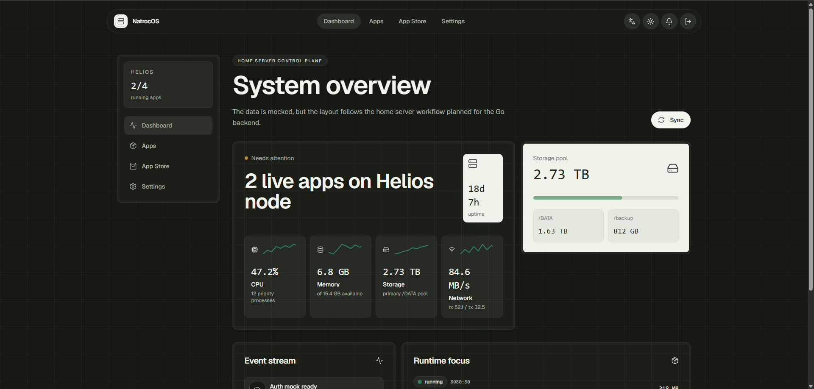

# **NatrocOS**

Before the HG680P STB can be used as a mini server with Armbian, there are several important steps that must be taken to ensure a smooth and risk-free installation. Many failures occur not during installation, but due to inadequate setup.

## Contributors

Thanks to everyone who has contributed to this project.

 

## License

Copyright 2026 PT Kelana Jaya Group.

This project is licensed under the Apache License, Version 2.0. See [LICENSE](./LICENSE) for the full license text.
